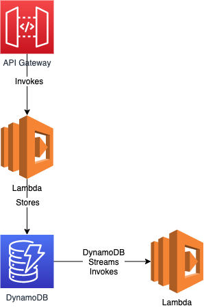

# Serverless Logging
A project which aims to demonstrate, by example, logging best-practices in the
serverless world. Specifically, this demonstrates:

* Capturing and forwarding of correlation Ids in an example serverless service.
* Debug log sampling using the DAZN powertools library.

## Example Service


## Usage
* Deploy the service: `serverless deploy`
* Using an HTTP client, make a POST request to the URL with the following payload
  ```
  {
	  "deviceId": "P54321"
  }
  ```
* As a response, you will also get the AWS requestId found in the headers. That's
your correlationId.
* Using this correlation Id, you can query the appropriate cloudwatch logs-groups
to find the trace of logs.