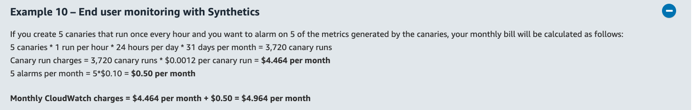
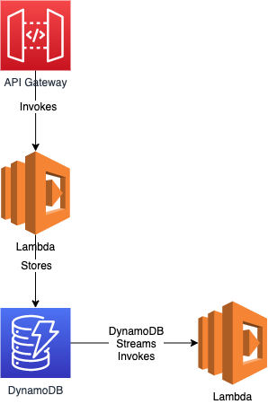
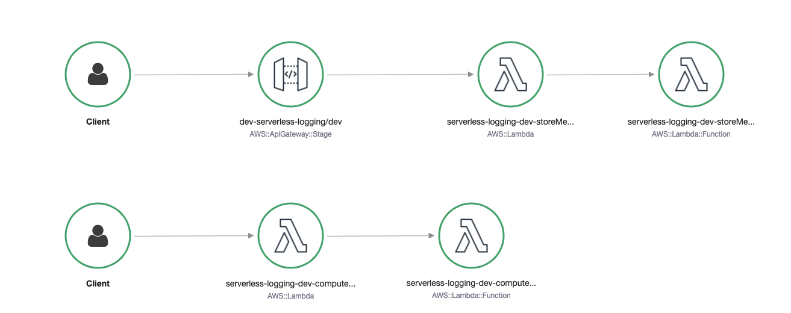
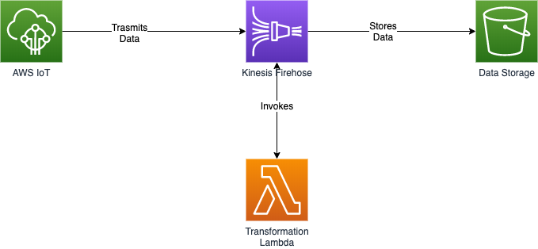
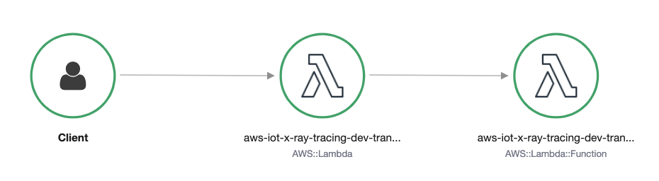
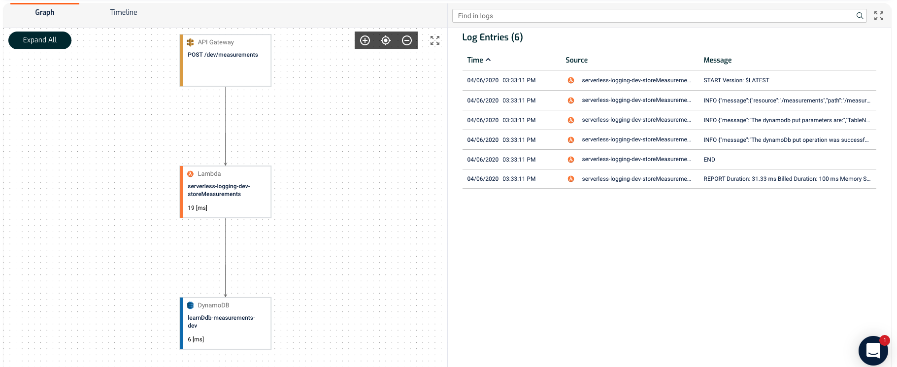
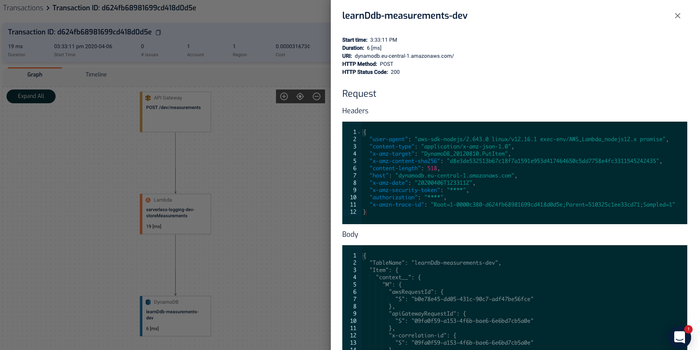

# Observability in the Serverless World
*Afaque Hussain*

---

## Monitoring the Production Web-App

* The CI/CD automatically deploys the web-app in the production env.
* How to test that the deployed web-app is working correctly from the end-user's perspective?
* How to find out if our web-app stops working, before our customers find that and report it?

----

## Monitoring the Production Web-App

* How do we do it now?
* Do we need automation?

----

## Amazon CloudWatch Synthetics

* Allows us to create Cypress-like tests which can be run periodically.
* Generate alerts when test fails.
* [Example Canary](https://eu-central-1.console.aws.amazon.com/cloudwatch/home?region=eu-central-1#synthetics:canary/detail/ccl-dev)
* Pricing is reasonable.
  

---

## Dashboard & Alerts

* AWS services we use:
  - Cognito, API Gateway, Lambda
  - DynamoDB, S3
  - AWS IoT, Kinesis Firehose
* AWS Lambda Service Console: Applications View
  - View metrics of AWS services used in each of our application service.

----

## Alerts

* We will come up with important metrics which we'd like to monitor in each AWS service we use.
* We will configure alerts on those metrics.

----

## Alerts

* `serverless-plugin-aws-alerts` allows to create alerts on lambda metrics.
* For other services, we will have to configure through CloudFormation (Resources section in `serverless.yml`).

---

## Tracing

* Visualize how service requests traverse different AWS services.
* View service metrics and latencies when the request traverses different services.

----

## X-Ray

Let's see how X-Ray traces this example service:


----

## X-Ray


----

## X-Ray

Let's see how X-Ray traces this example service:


----


## X-Ray


----

## Lumigo



----

## Lumigo



---

## Logging

* AWS services we use:
  - Cognito, API Gateway, Lambda
  - DynamoDB, S3
  - AWS IoT, Kinesis Firehose
* Enable logging on all those services?

----

## Logging

* Log levels we have mostly used:
```
log.info()
log.error()
```
* Default log level: `info`
* Suppose we want to debug a lambda function in production. How do we change the log-level?
* Other log-levels which we can take into use:
```
log.debug()
log.warn()
```

----

## Logging
* Log message example
```
{
    "error": {
        "code": "CUSTOMER_NOT_FOUND",
        "message": "CustomerId abc not found in this deployment!"
    },
    "level": "error",
    "message": "Error processing the record",
    "timestamp": "2020-03-25T06:15:43.786Z",
    "module": "lib/measurement-functions"
}
```

----

## Logging
* Improved logging using [DAZN Lambda Power Tools](https://github.com/getndazn/dazn-lambda-powertools)
```
{
    "message": "The dynamodb put parameters are:",
    "TableName": "learnDdb-measurements-dev",
    "Item": {
        "deviceId": "RFL100-P54321",
        "timestamp": 1584805871705,
        "temperature": 59,
        "lightIntensity": 37,
        "soundIntensity": 4
    },
    "awsRegion": "eu-central-1",
    "functionName": "serverless-logging-dev-storeMeasurements",
    "functionVersion": "$LATEST",
    "functionMemorySize": "1024",
    "environment": "dev",
    "awsRequestId": "d270e569-6fca-4803-8feb-63b529755a9c",
    "apiGatewayRequestId": "7f87c935-21d0-4838-b0f8-838ef992f796",
    "x-correlation-id": "7f87c935-21d0-4838-b0f8-838ef992f796",
    "User-Agent": "PostmanRuntime/7.23.0",
    "debug-log-enabled": "false",
    "call-chain-length": 1,
    "level": 20,
    "sLevel": "DEBUG"
}
```

----

## Logging Best Practices

* Capture and forward correlation Ids.
  - Let's see a demo using this example service.
  - 

----

## Logging Best Practices
* Sample debug logs.
* Don't log confidential information.
* Centralized logging
  - Use a log analytics service.
  - Setting Cloudwatch log expiration policy.

---

## Kiitos